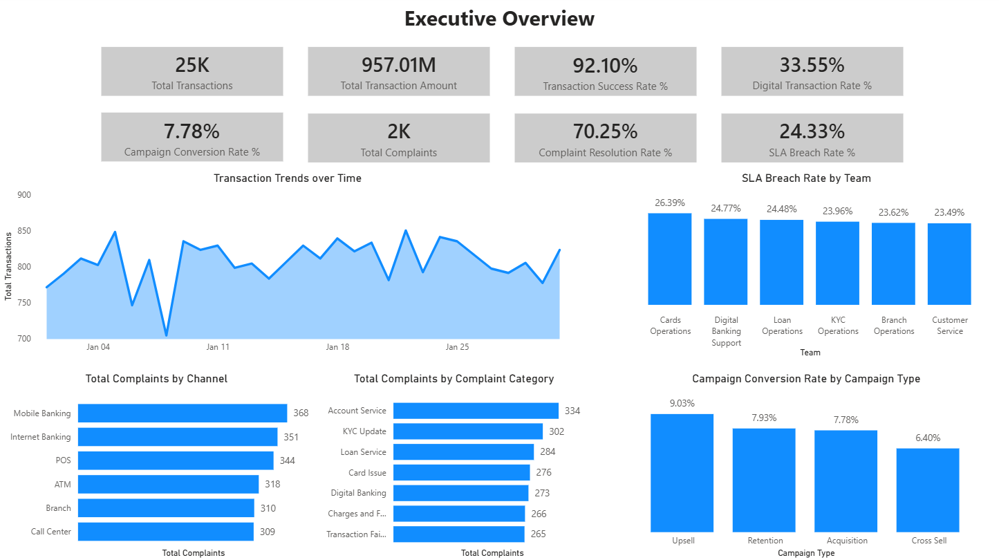
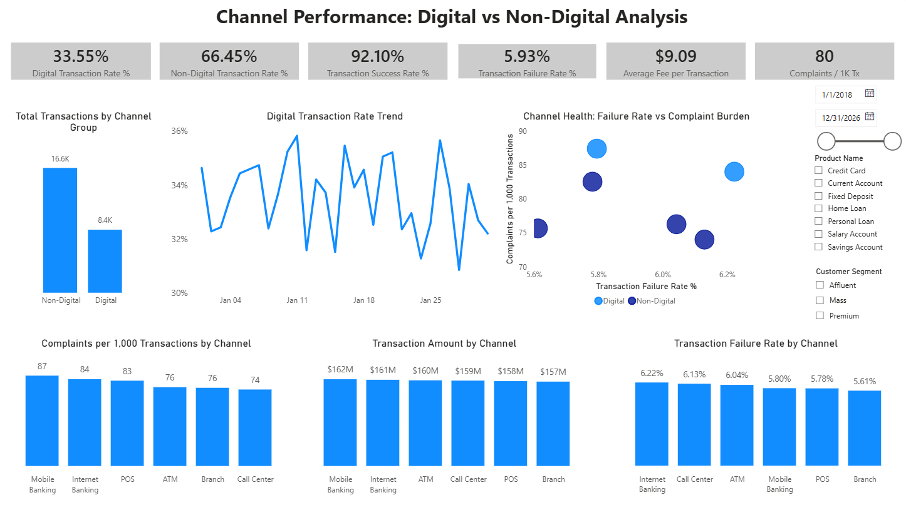
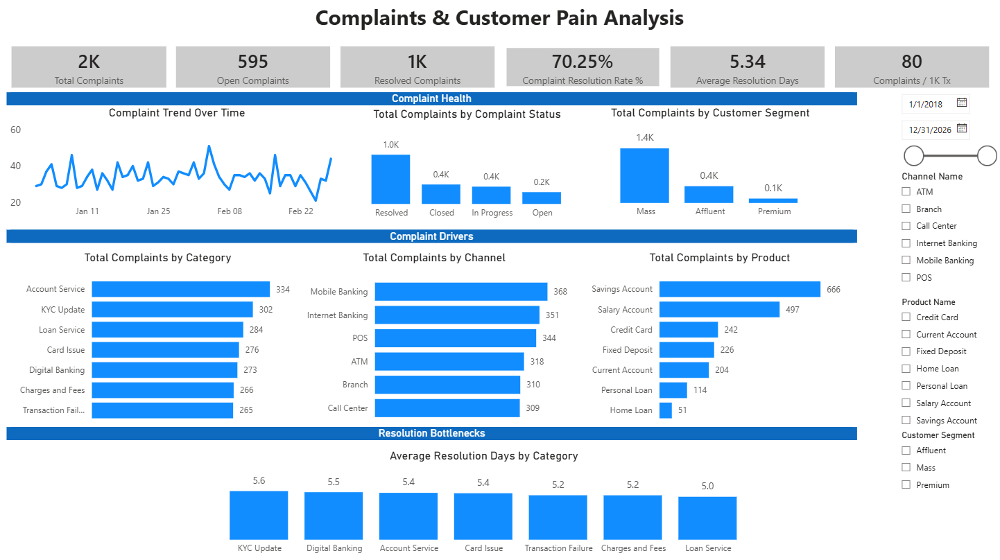
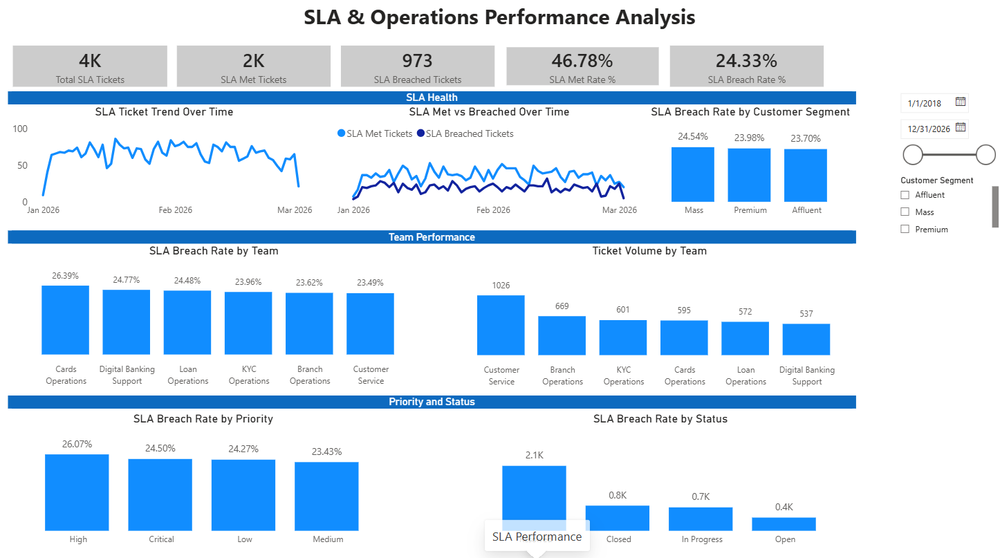
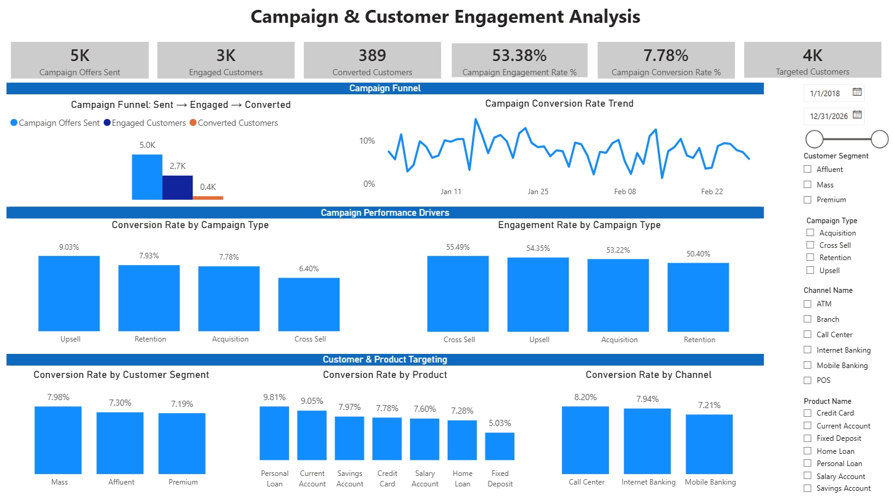

# Banking Operations Analytics

This project simulates a retail banking analytics environment using Python-generated operational data, PostgreSQL, SQL transformations, data quality checks, warehouse modeling, and Power BI reporting.

## Business Objective

The goal is to analyze customer activity, transaction performance, product usage, complaint trends, campaign effectiveness, and operational risk for a retail banking business.

## Core Components

- Python-generated banking source data
- PostgreSQL raw, staging, and warehouse layers
- SQL data quality checks
- Fact and dimension warehouse modeling
- Business KPI queries
- Power BI dashboard
- Business KPI documentation

## Planned Enhancements

- Incremental loading simulation for future monthly data batches such as February and March
- Power BI refresh workflow practice using updated warehouse data
- Connector/API-based data ingestion practice
- Additional campaign and customer behavior analysis

## Data Areas

- Customers
- Accounts
- Products
- Branches
- Channels
- Transactions
- Complaints
- Campaigns
- SLA Tickets

## Status

Power BI dashboard v1 complete. Incremental loading and refresh simulation planned for the next iteration.

## Power BI Dashboard

The Power BI dashboard provides a five-page business-facing view of banking operations performance.

### Dashboard Pages

1. Executive Overview
2. Channel Performance: Digital vs Non-Digital Analysis
3. Complaints & Customer Pain Analysis
4. SLA & Operations Performance Analysis
5. Campaign & Customer Engagement Analysis

### Executive Overview

### Channel Performance

### Complaints Analysis

### SLA Performance

### Campaign Performance

For detailed dashboard logic, KPIs, model assumptions, and interview explanation, see:

[Power BI Dashboard Notes](docs/15_powerbi_dashboard_notes.md)