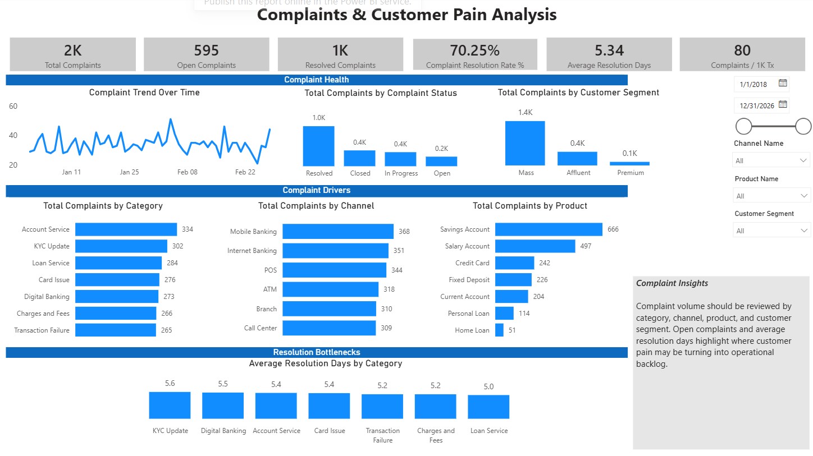
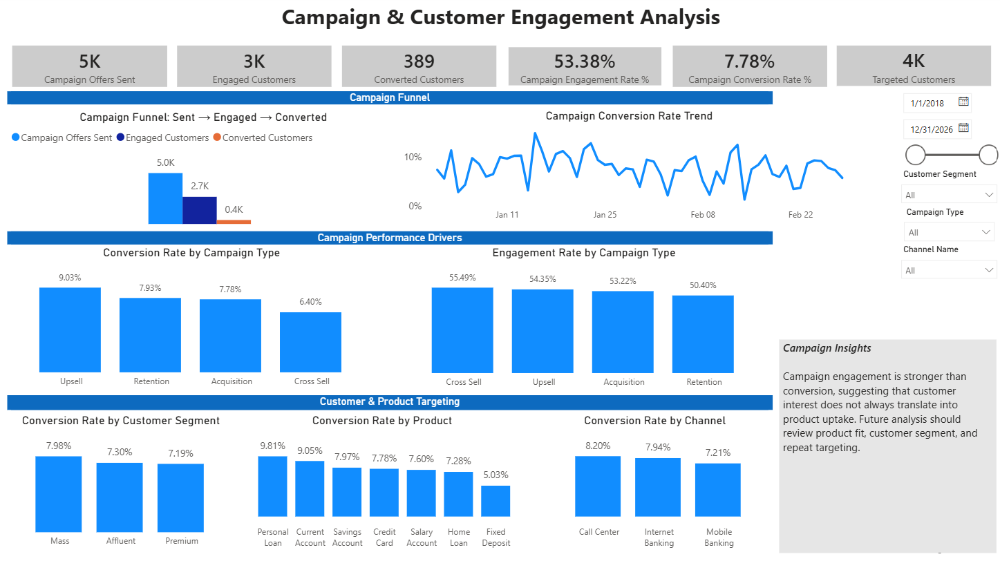

# Banking Operations Analytics

This project simulates a retail banking analytics environment using Python-generated operational data, PostgreSQL, SQL transformations, data quality checks, warehouse modeling, Power BI reporting, and a bounded Agentic AI investigation layer.

## Business Objective

The goal is to analyze customer activity, transaction performance, product usage, complaint trends, campaign effectiveness, and operational risk for a retail banking business.

## Core Components

- Python-generated banking source data
- PostgreSQL raw, staging, and warehouse layers
- SQL data quality checks and exception handling
- Fact and dimension warehouse modeling
- Business KPI queries
- Power BI dashboard
- Business KPI documentation
- Jan-Jun 2026 operational scenario data for agent and interview demonstrations
- Banking Operations Agent V2 using LangGraph, governed Markdown retrieval, controlled PostgreSQL tools, validation, and a FastAPI demo interface

## Current V2 Data Scope

The current demo dataset covers January through June 2026.

- Raw transaction rows: 188,015
- Unique transactions: 188,000
- Complaints: 7,500
- Campaign interactions: 16,400
- SLA tickets: 11,200
- Customers: 10,000
- Accounts: 15,000

The additional 15 raw transaction rows are intentional duplicates used for data-quality testing.

## Designed Analytical Signals

The six-month dataset contains controlled business patterns for investigation:

- January: operational baseline
- February: Mobile Banking transaction failure incident
- March: partial recovery
- April: complaint-volume and resolution backlog
- May: Digital Banking Support SLA deterioration
- June: stronger campaign engagement with weaker conversion

## Data Quality and Trusted Reporting Flow

The project intentionally keeps a small number of raw-layer exceptions so data-quality handling can be demonstrated rather than hidden.

Current controlled transaction exceptions include:

- 15 duplicate transaction rows
- 40 failed transactions with non-zero fees
- 20 missing `channel_id` values
- 309 high-value transactions flagged for review

The implemented flow is:

`raw source data -> DQ detection / exception capture -> cleaned staging -> warehouse -> reporting / agent tools`

Raw exceptions remain available for audit and agent investigation. Duplicate transactions are removed before the trusted warehouse, failed-with-fee values are corrected in the trusted staging layer, missing channel IDs are not invented, and legitimate high-value transactions remain in reporting data.

Final transaction reconciliation:

- Raw rows: 188,015
- Unique transaction IDs: 188,000
- Clean staging rows: 188,000
- Warehouse rows: 188,000
- Warehouse date coverage: 2026-01-01 through 2026-06-30

## Data Areas

- Customers
- Accounts
- Products
- Branches
- Channels
- Transactions
- Complaints
- Campaigns
- SLA Tickets

## Current Status

Power BI dashboard V1 is complete.

The Jan-Jun 2026 V2 data layer, controlled DQ scenarios, staging cleanup, DQ exception capture, and warehouse refresh have been completed and validated successfully.

Banking Operations Agent V2 is implemented under `v2_practical_agent/` for interview and portfolio demonstration. The bounded workflow uses LangGraph state/routing, scoped Markdown RAG, controlled parameterized PostgreSQL tools, deterministic read-only SQL validation, evidence validation, trace output, a golden evaluation suite, and a FastAPI/Swagger interface. Optional Claude synthesis can be enabled locally, while deterministic synthesis keeps the demo runnable without an LLM API key.

Production extensions such as vector embeddings, enterprise RBAC, durable checkpointing, MCP, production tracing infrastructure, and write-action HITL are intentionally documented as future design rather than represented as completed prototype features.

## Banking Operations Agent V2

The agent is designed for questions such as:

- What is Transaction Failure Rate?
- What was Mobile Banking failure rate in March 2026?
- Compare February and March Mobile Banking failure rate.
- Was March concerning for transaction failures in Mobile Banking?
- Show the data-quality exception summary.

The workflow separates relatively stable business knowledge from dynamic operational evidence:

`User -> LangGraph route -> RAG and/or PostgreSQL tool -> validation -> evidence-backed synthesis -> answer + source + period + trace`

See `v2_practical_agent/README.md` for setup, evaluation, exact demo commands, implementation boundaries, and FastAPI demo steps.

## Earlier Incremental-Load Design

A February-March incremental-load design exercise was completed before the scope changed to a six-month agent demo. That design is retained in `docs/v2_february_march_incremental_load_design.md` as an architecture exercise. For the interview-demo implementation, a controlled Jan-Jun full refresh was chosen to keep the data layer simple and spend more time on agent architecture, retrieval, API tools, validation, and observability.

## Power BI Dashboard

The Power BI dashboard provides a five-page business-facing view of banking operations performance.

### Dashboard Pages

1. Executive Overview
2. Channel Performance: Digital vs Non-Digital Analysis
3. Complaints & Customer Pain Analysis
4. SLA & Operations Performance Analysis
5. Campaign & Customer Engagement Analysis

### Executive Overview

### Channel Performance

### Complaints Analysis

### SLA Performance

### Campaign Performance

For detailed dashboard logic, KPIs, model assumptions, and interview explanation, see:

[Power BI Dashboard Notes](docs/15_powerbi_dashboard_notes.md)
