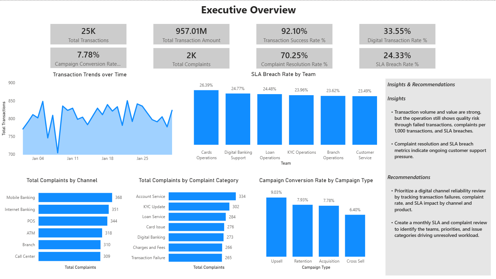
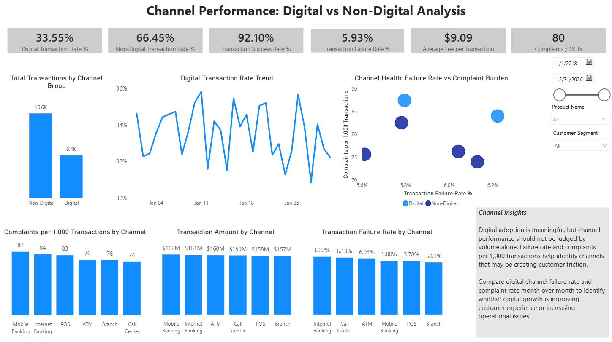
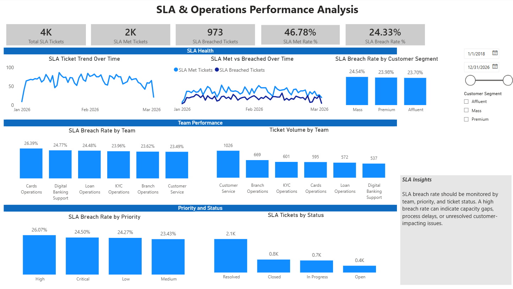

# Retail Banking Operations Analytics — Data Management & Reporting

This project demonstrates an end-to-end banking operations reporting workflow using **Python/Pandas, PostgreSQL, SQL, Power BI, and Git/GitHub**.

The business objective is to create a reliable operational view of transaction performance, customer complaints, and service-level performance. The technical objective is to make sure the reporting layer is trustworthy before KPIs are presented to a business user.

## How I explain the project

I started with a simple question: **what has to happen before a dashboard can be trusted?**

Rather than treating the source files as automatically clean, I profile the incoming data, load it into a relational database, validate relationships and business rules, reconcile record counts, create a reporting model, and only then calculate KPIs and visualize them in Power BI.

The project follows this flow:

```text
Synthetic source files
        ↓
Python / Pandas
Source profiling and basic checks
        ↓
PostgreSQL
Raw / staging data
        ↓
SQL
Validation, reconciliation, transformation
        ↓
Dimensional reporting model
Facts + dimensions
        ↓
Power BI
Operational KPIs and investigation
```

## Business questions

The reporting layer is designed to help an operations team answer questions such as:

- Are transactions succeeding at the expected rate?
- Are failures concentrated in a particular channel?
- Which complaint categories are creating the most customer pain?
- How quickly are complaints being resolved?
- Which support teams or priorities have higher SLA breaches?
- If a KPI deteriorates, where should the team investigate next?

## Data areas

The project uses connected banking operations data covering:

- **Customers** — who the bank serves.
- **Accounts** — the customer accounts on which activity occurs.
- **Transactions** — operational events such as successful and failed transactions.
- **Complaints** — customer-reported issues and their resolution status.
- **SLA tickets** — internal service tickets used to measure operational responsiveness.
- **Channels and branches** — dimensions used to understand where activity and problems are concentrated.

The data is synthetic and was created for learning and portfolio use.

## Step 1 — Profile the source data with Python/Pandas

Before loading data into reporting, I first want to understand the source.

The Python profiling script checks row counts, column counts, missing values, full-row duplicates, duplicate business IDs, and basic status distributions.

The purpose is not to perform every transformation in Python. I use Pandas because it is convenient for quickly inspecting incoming files. Once the data is in PostgreSQL, I use SQL for relational validation, reconciliation, transformation, and business analysis.

See: `python/profile_source_data.py`

## Step 2 — Build a reporting-oriented data model

The reporting layer separates **business events** from the descriptive information used to analyze them.

The fact tables contain events:

- `fact_transactions` — one row per transaction.
- `fact_complaints` — one row per complaint.
- `fact_sla_tickets` — one row per service ticket.

The dimensions describe those events:

- `dim_customer`
- `dim_account`
- `dim_branch`
- `dim_channel`
- `dim_date`

The most important concept here is **grain**: I need to know exactly what one row represents before I calculate a KPI. If a join accidentally duplicates an event row, transaction counts, amounts, or failure rates can become incorrect even though the final dashboard still looks reasonable.

See: `docs/DATA_MODEL.md`

## Step 3 — Validate and reconcile the data

A successful data load does not automatically mean the data is correct.

The SQL checks therefore look for:

- duplicate transaction IDs;
- transactions with no matching account or customer;
- missing channel references;
- failed transactions with unexpected fees;
- differences between staging and reporting row counts;
- duplicated transaction IDs in the reporting fact;
- unresolved dimension-key lookups.

One example is the orphan-account check. The business question behind the SQL is simple: **do I have any transaction claiming to belong to an account that does not exist in the account data?**

If an exception is found, I investigate the cause before deciding whether the record should be corrected, excluded, or retained as a known exception.

See: `sql/02_data_quality_checks.sql`

## Step 4 — Calculate business KPIs

Once the reporting layer is validated, SQL is used to answer business questions rather than only technical questions.

Examples include:

- overall transaction success rate;
- transaction failure rate by channel;
- total complaint volume and resolution rate;
- average complaint resolution time;
- complaint concentration by category and priority;
- SLA breach rate by support team and ticket priority.

The goal is to move from **“What is the number?”** to **“Where is the problem concentrated, and what should operations investigate?”**

See: `sql/03_business_queries.sql`

## Step 5 — Present the results in Power BI

### Executive overview

The executive page gives a high-level view of banking operations. It is intended to answer: **Is the operation healthy, and is anything changing enough to require investigation?**



### Channel performance

The channel view helps determine whether a transaction problem is broad or concentrated in a particular channel. A localized issue requires a very different operational response from a bank-wide issue.



### Complaints

Complaint reporting provides a customer-impact perspective. If transaction performance deteriorates and complaints rise in the same channel or period, that provides stronger evidence about where the problem may be occurring.


### SLA performance

The SLA page moves from customer impact to the internal process. If one team or ticket type has higher breaches, the next step is to investigate workload, prioritization, handoffs, process bottlenecks, or automation opportunities.



## How the technical and business pieces connect

The dashboard is not the end of the analysis.

The workflow is:

**Reliable source data → validated reporting model → trustworthy KPI → focused investigation → operational/process-improvement question.**

For example, if the overall transaction failure rate rises, I would first break it down by channel and time period. If one channel is driving the increase, I would then investigate the relevant transaction types, operational changes, and related complaint patterns.

Similarly, if SLA breaches are concentrated in one support team, I would investigate whether the cause is capacity, prioritization, handoffs, or another process constraint.

## What I learned

The most important learning from this project is that visualization is only one part of analytics. Reliable reporting also requires clear KPI definitions, correct grain, dependable relationships, data-quality checks, and reconciliation between processing layers.

This project was built in a controlled learning environment using synthetic data. The next level of experience is applying the same reasoning in an existing client environment with real schemas, established refresh processes, data dependencies, change controls, and downstream users.

## Project files

```text
04-banking-operations-analytics-mini/
├── README.md
├── requirements.txt
├── python/
│   └── profile_source_data.py
├── sql/
│   ├── 01_reporting_model.sql
│   ├── 02_data_quality_checks.sql
│   └── 03_business_queries.sql
├── docs/
│   ├── DATA_MODEL.md
│   └── PROJECT_WALKTHROUGH.md
├── data/
│   └── README.md
└── assets/
    ├── 01_executive_overview.png
    ├── 02_channel_performance.png
    ├── 03_complaints_analysis.png
    └── 04_sla_performance.png
```
